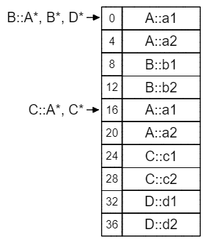
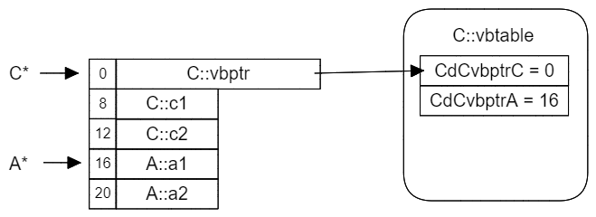
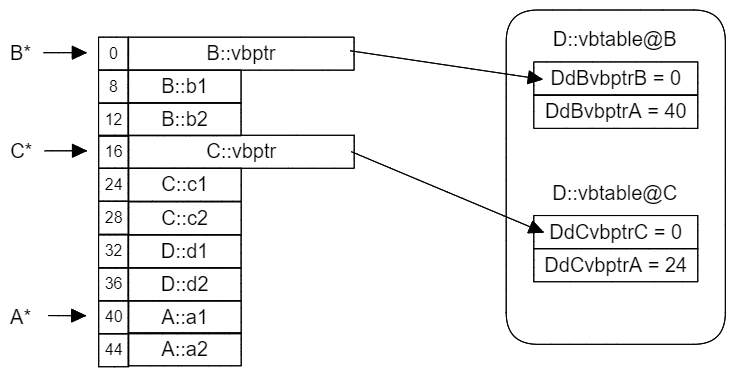
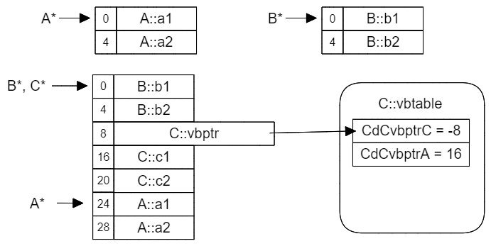

# virtual

## 虚函数

加了virtual关键字的函数就是虚拟函数

虚拟函数的主要体现在于指针操作

```c++
#include <bits/stdc++.h>
using namespace std;

class Father{
public:
	virtual void output(){
		cout << "this is father" << endl;
	}
};

class Son : public Father{
public:
	void output(){
		cout << "this is son" << endl;
	}
};

int main(){
	Father* p = new Son();
	p -> output();
	Father fa = Son();
	fa.output();
	return 0;
}
```

如图所示，son类是father类的派生类，在father类和son类中都有函数output，其中father类中的output函数为虚函数。虚函数的概念主要体现在指针方面，对比p和fa两个变量，分别将Son类型的指针和Son类型的变量赋给Father类型的指针和变量，前者父类的output方法被子类的output方法覆盖，体现了指针变量下的父类output函数的虚函数特性；后者父类的output方式依然没有被覆盖，数据变量下的父类output函数虚函数特性不体现。

## 纯虚函数

我们想象这样一个情景，父类是“动物”，子类则是“老虎”，“蜥蜴”，“蝙蝠”等等，这种情况下父类“动物”本身并没有任何行为，但其子类都有跑、走、跳等动作，我们能够在父类中定义关于跑、走、跳等纯虚函数，要求子类一定要实现

```c++
#include <bits/stdc++.h>
using namespace std;

class Father{
public:
	virtual void output() = 0;
};

class Son1 : public Father {
public:
	void output(){
		cout << "this is son1" << endl;
	}
};

class Son2 : public Father {
public:
	void output(){
		cout << "this is son2" << endl;
	}
};

int main(){
	Son1 son1 = Son1();
	son1.output();
	return 0;
}
```

纯虚函数在实现上实际上是虚函数的更进一步，在函数头定义之后加上=0标志

### 抽象类

含有纯虚函数的类就是抽象类，抽象类不能被实例化，只能被作为基类。

例如世界上只有老虎大象熊猫，没有一个东西叫做动物。

## 虚继承（虚基类）

多继承的命名冲突和冗余数据问题，派生类中只保留一份间接基类的成员

本质：让某个类作出声明，承诺愿意共享，被共享的基类就是虚基类

虚派生影响制定了**虚基类的派生类**进一步派生出来的类，也即是虚基类的派生类的派生类


多基类继承引发的命名冲突问题，D中有两份A基类中的成员（分别继承自B和C）


虚继承的概念：派生类在继续派生的情况下，只保留一份自己本身基类的成员（不与BC冲突）

### 代码

```c++
#include <bits/stdc++.h>
using namespace std;

class A {
public:
	int x;
	A(){
		this -> x = 1;
	}
};

class B : virtual public A {
	
};

class C : virtual public A {
	
};

class D : public B, public C {
	
};

int main(){
	D ele;
	cout << ele.x << endl;
}
```

B，C类在继承A的过程中使用了关键字virtual，即指明了虚继承，在B、C中如果继续继承那么D中指挥继承一份A的数据元素

## 单继承的布局 https://www.cnblogs.com/ThousandPine/p/18111381

```c++
class A
{
public:
    int a1;
    int a2;
};
class B : public A
{
public:
    int b1;
    int b2;
};
```

观察两个类的存储结果

```
class A	size(8):
	+---
 0	| a1
 4	| a2
	+---

class B	size(16):
	+---
 0	| +--- (base class A)
 0	| | a1
 4	| | a2
	| +---
 8	| b1
12	| b2
	+---
```

我们发现A类的成员在B类成员的前面，所以A类的指针能够直接指向B类的成员。

## 多继承的布局

```c++
class A
{
public:
    int a1;
    int a2;
};
class B
{
public:
    int b1;
    int b2;
};
class C : public A, public B
{
public:
    int c1;
    int c2;
};
```

如图所示，C继承自A和B


AB都在C的成员前面，C的成员在最后，但是B起始地址的偏移量非0

因此倘若C指针转换为B指针，需要在原有的基础上进行偏移

## 菱形继承的存储原理

```c++
class A
{
public:
    int a1;
    int a2;
};
class B : public A
{
public:
    int b1;
    int b2;
};
class C : public A
{
public:
    int c1;
    int c2;
};
class D : public B, public C
{
public:
    int d1;
    int d2;
};
```

A中的成员在D中保存了两份



如果我们访问A中的元素的时候，我们无法指明是那一份A；我们将D类指针，指向A类变量的过程中，我们也不知道他要指向那一份数据

## 虚继承的存储原理

```c++
class A
{
public:
    int a1;
    int a2;
};
class C : virtual public A
{
public:
    int c1;
    int c2;
};
```



虚继承产生的类在存储方面与正常继承产生的类有不同

- 基类的元素放在派生类之后
- 派生类首地址为vbptr，指向vbtable，两个元素分别为A和C元素存储地址的偏移量

当我们访问C中的元素的时候通过查表找到偏移量，计算A和C元素的起始地址

## 菱形继承的虚继承运用

```c++
class A
{
public:
    int a1;
    int a2;
};
class B : public A
{
public:
    int b1;
    int b2;
};
class C : public A
{
public:
    int c1;
    int c2;
};
class D : public B, public C
{
public:
    int d1;
    int d2;
};
```



这里A只继承了一份并且放在D类的最后面，当要访问B和C中的A元素的时候我们直接访问B和C中的vbtable即可

## 虚表指针的位置

```c++
class A
{
public:
    int a1;
    int a2;
};

class B // 注意，这次B没有继承A
{
public:
    int b1;
    int b2;
};

class C : virtual public A, public B
{
public:
    int c1;
    int c2;
};
```



A是虚继承，B是普通继承

- 普通继承，基类中的元素放在派生类的最前面
- 虚继承中，基类中的元素放在派生类的最后面，派生类的最前面为派生类元素以及派生类指针

进一步理解上述继承

- A是虚继承，B是普通继承，虚继承的元素放在最后，普通继承的元素放在最前，中间的元素是派生类的元素和派生类的指针
- 派生类的虚表指针简单理解为派生类的一个元素

## 公用虚基类表

```c++
class A
{
public:
    int a1;
    int a2;
};

class B : virtual public A
{
public:
    int b1;
    int b2;
};

class C : virtual public A, public B
{
public:
    int c1;
    int c2;
};
```


简述一下这个过程：B虚继承A，C虚继承A并继承B

- B在虚继承A的过程中将A的元素放在最后，将B本身的成员和虚继承表放在最前面
- C虚继承自A并且继承虚继承自A的B，可以这样理解，C虚继承自A的过程中会产生一个虚表，继承自B的过程中继续继承B中原来的虚表。第一个虚表，将A的元素放到最后，在C的开头设置一个虚表；第二个虚表，将B的元素连同着B的虚表放在C的开头。可以发现同一个位置有两个虚表，因此我们选择将两个虚表合并出现了**公用虚基类表**

## 总结

virtual关键字描述的基类函数允许指针变量或引用变量的重写