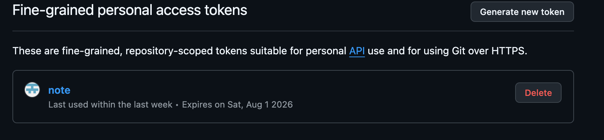

# 创建MAC本地项目

在mac本地创建一个文件夹，名为note，使用git clone命令将GitHub上的文件下载到本地

```zsh
git clone <项目URL>
```

当然这个下载下来的文件依然有无法推送的问题，也就是说，它在本地只能编辑，不能更新GitHub中的项目，实际上为了解决这个问题，个人还是花了很大的精力的

GitHub在本地项目推送到云端的操作上分为HTTPS以及SSH两种操作

- HTTPS

  本质上来说HTTPS实际上就是HTTP加上一个加密层的协议，使用HTTPS将要求输入用户名密码

  然而在我第一次操作HTTPS希望将其上传到GitHub上时候得到了以下回复

  ```zsh
  chenzhiyuan@chenzhiyuandeMacBook-Air note % git push -u origin master
  Username for 'https://github.com': ChikingChen 
  Password for 'https://ChikingChen@github.com': 
  remote: Invalid username or token. Password authentication is not supported for Git operations.
  fatal: 'https://github.com/ChikingChen/note.git/' 鉴权失败
  ```

  原因是我使用的是自己账户的密码，但现在GitHub需要个人访问令牌才能将本地项目推送到云端

  因此我创立了自己的个人访问令牌，并将令牌创建时候得到的密码输入

  

  但因为令牌权限的不足（实际上我已经选择了令牌权限为所有项目，可能是令牌权限仅限读），得到如下结果

  ```zsh
  Username for 'https://github.com': ChikingChen
  Password for 'https://ChikingChen@github.com': 
  remote: Permission to ChikingChen/note.git denied to ChikingChen.
  fatal: 无法访问 'https://github.com/ChikingChen/note.git/'：The requested URL returned error: 403
  ```

  403代表我的账号密码是正确的，但是权限不足，权限问题主要来源还是令牌，当然实力有限，无法解决，但DeepSeek给了我另一条路也就是SSH

- SSH

  SSH使用RSA作为自己的加密算法，建立起连接，熟悉RSA的朋友应该都知道公钥以及密钥的概念，在SSH连接中我们的公钥还是密钥都是本地生成的，使用zsh指令生成

  ```zsh
  ssh-keygen -t ed25519 -C "your_email@example.com"
  ```

  执行完上面这条指令之后我们查看~/.rsa中的内容，发现了id_rsa以及id_rsa.pub两个文件，其中前者即为我们的密钥，后者为公钥，公钥的内容复制完后添加到GitHub SSH key中，当我们再次尝试将本地的内容上传到GitHub云端就会发现成功了

  > 实际上一个本地项目究竟是使用HTTPS还是SSH连接是事先设置好的，我们通过zsh指令即可查看
  >
  > ```zsh
  > git remote -v
  > ```
  >
  > 如果显示如前两者即为HTTPS连接，后两者即为SSH连接
  >
  > ```zsh
  > # HTTPS连接
  > origin  https://github.com/username/repo.git (fetch)
  > origin  https://github.com/username/repo.git (push)
  > 
  > # SSH连接
  > origin  git@github.com:username/repo.git (fetch)
  > origin  git@github.com:username/repo.git (push)
  > ```
  >
  > 其实可以理解为GitHub为不同的连接提供了不同的API进行调用，而我们通过设置remote地址来设定自己在与GitHub交互时候访问的API，当然remote -v的结果更改也相对容易
  >
  > ```zsh
  > git remote set-url origin git@github.com:username/repo.git
  > ```
