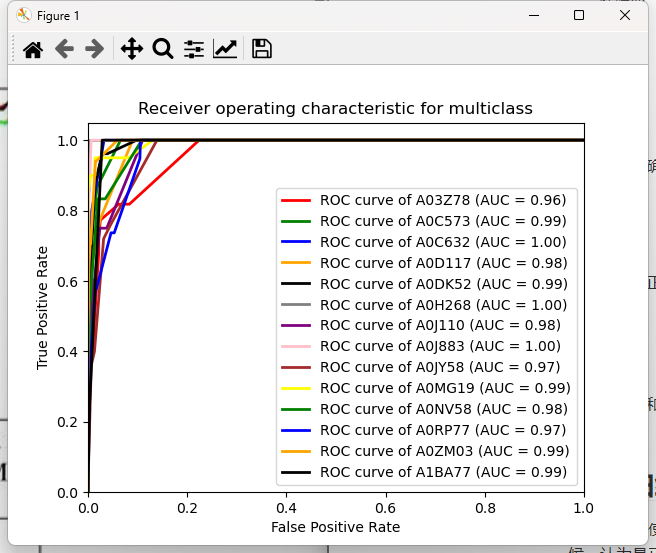
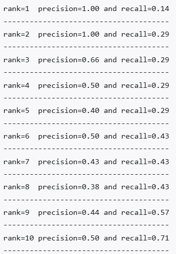

# 机器学习指标

## 二分类中的计算

- 真阳性（TP）：预测结果为**阳**，真实结果也**阳**
- 假阳性（FP）：预测结果为**阳**，真实结果为**阴**
- 真阴性（TN）：预测结果为**阴**，真实结果为**阴**
- 假阴性（FN）：预测结果为**阴**，真实结果为**阳**

## 机器学习指标

- $accuracy$（准确率）
  $$
  A=\frac{TP+TN}{N}
  $$

- $precision$（精确率）
  $$
  P=\frac{TP}{TP+FP}
  $$
  预测正确的正例个数占预测为正例数据的比例

- $recall$（召回率）
  $$
  R=\frac{TP}{TP+FN}
  $$
  预测为正确的正例个数占实际为正例数据的比例

- $F1$
  $$
  F=\frac{2}{\frac{1}{P}+\frac{1}{R}}
  $$
  $precision$和$recall$的调和平均数

> 事实上，在$precision$和$recall$的定义中避免使用$TN$实际上保证了以上指标从二分类到多分类的拓展

- $IoU$

  物体识别中的概念，评价预测的边界框和预先输入的边界框的差别

  

  实际上在这种情况下只有$TP$和$FP$的概念

  

## 理解

- 为什么要引入除了$accuracy$之外的指标？

  对于不平衡数据集而言，$accuracy$不是一个比较好的指标

- $recall$和$precision$的区别

  $recall$重视$FN$，$precision$重视$FP$，$FN$是实际为正确，预测为错误的样本；$FP$则是实际为错误，预测为正确的样本

  考虑这样两个情况

  - 癌症诊断中，如果出现明明是患病的（阳性），但诊断为未患病的（阴性），也就是假阴（$FN$），这种情况下那么可能会有比较严重的后果，因此我们更加重视召回率（$recall$）的数值
  - 垃圾邮件分类中，如果出现明明是正常的邮件（阴性），但被识别为垃圾邮件（阳性），也就是假阳（$FP$），这种情况下会让人感到难过，因此我们更加重视精确率（$precision$）的数值

  可以理解的是$F1$数值则同时兼顾了$precision$以及$recall$

## 二分类到多分类的拓展

二分类到多分类的拓展实际上主要聚焦于四个指标的定义，事实上在多分类的指标中并没有$TN$的概念，这种情况下多分类三个指标的定义显得顺理成章，在我们确定一个多分类的类别后，将显示为当前类别的结果或者标签标记为阳性，而非当前类别的结果活标签标记为阴性，套入二分类的公式后即可计算多分类指标

- $TP$

  预测是正确的，实际是正确的

  一个样本，实际是选定类型，预测是选定类型

- $FP$

  预测是正确的，实际是错误的

  一个样本，实际非选定类型，预测是选定类型

- $FN$

  预测是错误的，实际是正确的

  一个样本，实际是选定类型，预测非选定类型

- $TN$（多分类评价中并不考虑）

  与测试错误的，实际是错误的

  一个样本，实际非选定类型，预测非选定类型

可以理解的是对于一组多分类数据以及一个特定的模型，利用$recall$以及$precision$评价多分类的时候会存在多个结果（一个类别对应一个），我们将几个平均即可得到结果

## ROC曲线

样本数据，使用分类器分类会给出正例的概率，我们对此设计一个阈值，当某个样本为正例的概率大于阈值的时候，认为是正例，否则是负例，我们不断调整这个阈值即可得到一个曲线

- 总结

  对一组样本，当我们通过模型预测的时候能够得到这组样本为正例的概率，每个样本有一个对应的数值，我们设定一个阈值，当高于这个阈值的时候判定为阳，低于这个阈值的时候判定为阴，这种情况下我们能够得到一组假阳性率和真阳性率，将这组概率绘画到图上连线即为ROC曲线

### 项目中ROC曲线的解释

假设现在要绘制关于$A03Z78$的曲线，那么我们将所有的样本关于$A03Z78$做一个预测，即可得到概率，对此概率绘制$ROC$曲线即可

## AUC

ROC曲线下的面积，代表随机挑选一个正样本和一个负样本，根据当前的分类器计算得到的$score$正样本在负样本之前的概率

## AP mAP

link：https://zhuanlan.zhihu.com/p/56961620

物体识别中模型性能衡量标准

- 物体检测的结果

  预测框以及置信概率。置信概率：类别以及概率；预测框：物体所在位置。

- 预测正确的定义

  类别正确且置信概率大于**阈值**；IoU大于**阈值**

### 样例

5张照片，7个dog，GT即为7，存在10个预测结果，选择IoU_threshold=0.5作为IoU门槛，大于且预测结果与实际结果吻合即为GT=1

在假设置信度门槛为0的情况下，TP（检测到且吻合）=5，FP（检测到未吻合）=5，FN（未检测到）=2

计算precision以及recall的数值

- $precision$（精确率）
  $$
  P=\frac{TP}{TP+FP}
  $$
  预测正确的正例个数占**预测为正例数据**的比例

- $recall$（召回率）
  $$
  R=\frac{TP}{TP+FN}
  $$
  预测为正确的正例个数占**实际为正例数据**的比例

> 什么样的数据会被预测为正例数据？
>
> 置信度高于置信度门槛的数据，不需要GT为1
>
> 什么样的数据会被当作预测正确的正例数据？
>
> 置信度高于置信门槛同时GT为1

PR曲线绘画

PR曲线下的面积即为AP，需要注意的是曲线需要经过平滑

方法是，查全率r对应的查准率p，取查全率大于等于r时最大的查准率p。

mAP即为各个类别AP的均值

## 总结

mAP在综合置信度和IoU的基础上对图像识别性能作出评判，同时综合描绘了在高置信度门槛和低置信度门槛的情况下模型的表现能力