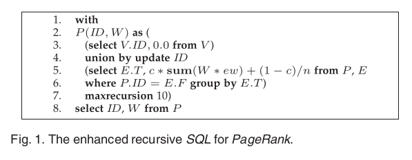

# PageRank

PageRank算法实际上与马尔可夫链模型比较相似

PageRank算法将整个互联网都建模成一张有向图，每个网页都是一个结点，网页上的超链接则是结点之间的有向边。通过简化，我们认为同一结点进入相邻结点的概率相等，倘若一个结点与$n$个结点相连，那么进入相邻结点的概率就都是$\frac{1}{n}$，如此我们能够定义出自己的状态转移矩阵

在如上这个图中，我们的状态转移矩阵如下
$$
M=\begin{bmatrix}
0&0&1\\
\frac{1}{2}&0&0\\
\frac{1}{2}&1&0\\
\end{bmatrix}
$$
通过计算$R_{t+1}=MR_t$，我们能够计算出$t+1$时刻的状态

根据马尔科夫链模型我们认为通过多个时刻计算$\lim_{t\rightarrow\infin}M^tR_0=R$，$R$将趋于平稳

## 在理想模型中导入平滑项

在一般情况下，我们在当前页面浏览完成之后将会直接从当前页面退出，而进入别的页面，这个概率我们设置为$1-d$，相应的我们设置概率$d$为从当前页面跳转到别的页面
$$
R=MR\Rightarrow R=dMR+(1-d)\begin{bmatrix}
\frac{1}{n}\\
\frac{1}{n}\\
\ldots\\
\frac{1}{n}
\end{bmatrix}
$$

## 如何使用数据库语言计算PageRank

$$
V\leftarrow\rho_V(E\bowtie^{f_1(\cdot)}_{T=ID}V)
$$

$f_1(\cdot)$代表$c*sum(vw*ew)+(1-c)/n$

这里的$V$代表时刻$t$时候的各个状态出现可能性的列向量，假设我现在要关注$S_1$状态在下一个时刻$t+1$中出现的概率，那么我就只要关注各个状态出现可能性乘上转移到$S_1$状态的可能性的乘积的总和，这个总和对应着PageRank中的$MR$部分，加入平滑项$c$即为我们的PageRank整体公式

我们可以认为$vw*ew$是连接操作，$sum()$则是聚合操作，剩下的乘法和加法就是对数据的简单处理

通过多次迭代，我们就能够得到PageRank的最终状态

## 通勤时间

$$
CT(u,v)=h_{uv}+h_{vu}
$$

通勤时间是两个结点相互到达的期望点击数之和

## union by update

union by update是相较于union发展起来的，union用于将两个数据集合并起来，对于重复的列使用聚合函数进行聚合；union by update是使用新数据集来将老的数据集覆盖，用于在迭代过程中将新的数据集覆盖老的数据集，可以认为是增加了一种聚合方式，适用于GAS中的S阶段

## 使用增强的递归sql实现pagerank算法

一个sql递归的伪代码，氛围两部分，在union之前的是初始值，union之后的是迭代的部分，迭代的部分使用生成的内容来更新初始值，既保证了每个点最少一个初始值，有保证了迭代的有效性，并且设置了最多迭代10次的要求

## 
