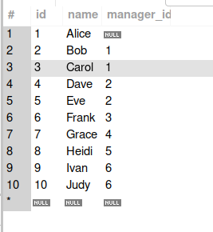
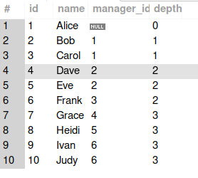

# 递归SQL

## with关键字

with能够定义一个临时命名结果集（可以认为是一个临时表，在with所在的语句结束后这个临时表即可消失），在当前语句中这个临时表存在，我们能够通过对这个临时表做出操作来达到自己的目的。

以下为基本用法

```mysql
WITH cte_name AS (
    SELECT ...
)
SELECT * FROM cte_name;
```

以下展示一个例子

```mysql
with team as (
	select * from emp where manager_id = 1
)select * from team;
```

上述语句中将emp表中选取的内容合并为一张名为team的表，这个名为team的表在后面select语句中继续使用

## union和union all

union能够将两个或者多个select语句的结果集合并，以下展示一个例子

```mysql
SELECT column_list FROM table1
UNION
SELECT column_list FROM table2;
```

- union和union all的区别

  union有去重的概念，union all没有去重的概念

## mysql别名

当你在书写一个表名的时候，在他后面空一个空格书写一个名字就能定义他的别名

```mysql
FROM emp AS e    -- 标准写法
FROM emp e       -- 简写，等价
```

实际上是对as的一个简写

## join关键字

连接两张数据表，默认使用内连接

- 内连接

  ```mysql
  SELECT e.id, e.name, d.dept_name
  FROM emp e
  INNER JOIN dept d ON e.dept_id = d.id;
  ```

  两张表联合，on表示连接要求

## with recursive递归

- 数据库建表

  ```mysql
  -- 1) 表结构
  DROP TABLE IF EXISTS emp;
  CREATE TABLE emp (
    id          INT PRIMARY KEY,
    name        TEXT NOT NULL,
    manager_id  INT REFERENCES emp(id)
  );
  
  -- 2) 示例数据
  INSERT INTO emp (id, name, manager_id) VALUES
    (1, 'Alice',   NULL),   -- Alice 是大老板
    (2, 'Bob',     1),
    (3, 'Carol',   1),
    (4, 'Dave',    2),
    (5, 'Eve',     2),
    (6, 'Frank',   3),
    (7, 'Grace',   4),
    (8, 'Heidi',   5),
    (9, 'Ivan',    6),
    (10,'Judy',    6);
  
  -- 可选：给 manager_id 建索引，递归时更快
  CREATE INDEX ON emp(manager_id);
  ```

  建立结果

  

- 递归查询级别

  ```MySQL
  WITH RECURSIVE team AS (
    -- 基例：Alice 自己
    SELECT id, name, manager_id, 0 AS depth
    FROM emp
    WHERE name = 'Alice'
  
    UNION ALL
  
    -- 递归步：找每一层的直接下属
    SELECT e.id, e.name, e.manager_id, t.depth + 1
    FROM emp e
    JOIN team t ON e.manager_id = t.id
  )
  SELECT * FROM team
  ORDER BY depth, id;
  ```

  

> 两个关系变量，分别team以及emp(id, name, manager_id)，team(id, name, manager_id, depth)为递归查询的中间变量，emp则是存储职员信息的表
>
> 首先使用了'Alice'作为基点向下递归查询，也就是说从emp表中查询除了‘Alice’的信息
>
> ```mysql
> SELECT id, name, manager_id, 0 AS depth
> FROM emp
> WHERE name = 'Alice'
> ```
>
> 其次，我们现在看这样一个事情，team中的实例是从上到下遍历出的实例，我们在遍历出一层的team中的实例之后肯定希望遍历下一层，而下一层中的实例则存在于emp数据表中，我们需要使用一种方法把emp数据表和team关联起来。然而对于emp中下一层的实例来说，manager_id实际上存在于team中，因此我们能够通过emp.manager_id和team.id的联系来将两者相连。使用join关键字将两个表相连，生成的新表属性如下(e.id, e.name, e.manager_id, t.id, t.name,t.manager_id, t.depth)，我们可以理解的是关于t的内容都是父子关系中的父，关于e的内容都是关于父子关系中的子，我们选取e的属性作为新的节点
>
> ```mysql
> SELECT e.id, e.name, e.manager_id, t.depth + 1
> FROM emp e
> JOIN team t ON e.manager_id = t.id
> ```
>
> 关于重复的问题，我们可以这么看，实际上每一次从emp中选取出来的数据都要求都要求e.manager_id不为空，加上为空的'Alice'实际上不会产生重复

## case

```mysql
CASE 表达式
    WHEN 值1 THEN 结果1
    WHEN 值2 THEN 结果2
    ...
    ELSE 默认结果
END
```

以上表示了一个最简单的case语句，第一个表达式能够调用数据表中的一些属性进行计算，计算出来的值在下方多个when中对计算结果进行判断而后选择不同的结果（类似C语言中的case语句），这个结果实际上就是这个式子的结果。如果这个表达式为空，那么当我们计算when的时候就只能使用当前case所在语句中提到的数据库的属性

## 增强的递归SQL

普通的递归sql，通过递归sql进行bfs

```mysql
WITH RECURSIVE reach(v, dist, visited) AS (
  -- 基例：起点
  SELECT :src, 0, CONCAT('/', :src, '/')

  UNION ALL

  -- 递归步：从上一轮 frontier 沿出边扩展一层
  SELECT e.dst, r.dist + 1, CONCAT(r.visited, e.dst, '/')
  FROM edges e
  JOIN reach r ON e.src = r.v
  WHERE INSTR(r.visited, CONCAT('/', e.dst, '/')) = 0  -- “没来过就扩展”
)
SELECT v, MIN(dist) AS hops
FROM reach
GROUP BY v;
```

增强的递归sql加入了**迭代控制**和**更新语义**等等概念，这里介绍一个SSSP算法

```mysql
CREATE TABLE dist AS
SELECT v, CASE WHEN v = :src THEN 0 ELSE 1e100 END AS d FROM vertices;

WHILE CHANGED() DO
  WITH cand AS (   -- Gather：邻居候选距离
    SELECT e.dst AS v, MIN(d.d + e.w) AS new_d
    FROM dist d JOIN edges e ON e.src = d.v
    GROUP BY e.dst
  )
  UPDATE dist      -- Apply：更优才写回
  JOIN   cand USING(v)
  SET dist.d = cand.new_d
  WHERE cand.new_d < dist.d;
END WHILE;

SELECT * FROM dist;
```


