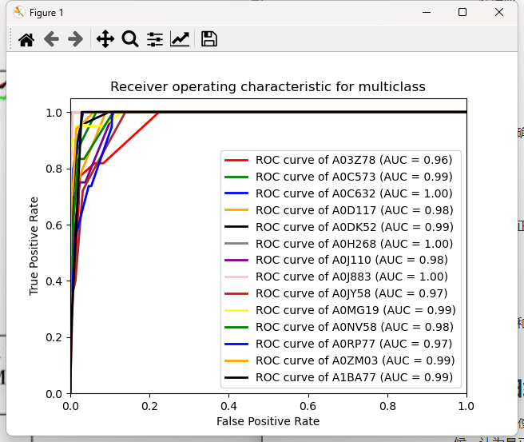

# 机器学习指标

## 二分类中的计算

- 真阳性（TP）：预测结果为**阳**，真实结果也**阳**
- 假阳性（FP）：预测结果为**阳**，真实结果为**阴**
- 真阴性（TN）：预测结果为**阴**，真实结果为**阴**
- 假阴性（FN）：预测结果为**阴**，真实结果为**阳**

## 机器学习指标

- $accuracy$（准确率）
  $$
  A=\frac{TP+TN}{N}
  $$

- $precision$（精确率）
  $$
  P=\frac{TP}{TP+FP}
  $$
  预测正确的正例个数占预测为正例数据的比例

- $recall$（召回率）
  $$
  R=\frac{TP}{TP+FN}
  $$
  预测为正确的正例个数占实际为正例数据的比例

- $F1$
  $$
  F=\frac{2}{\frac{1}{P}+\frac{1}{R}}
  $$
  $precision$和$recall$的调和平均数

> 事实上，在$precision$和$recall$的定义中避免使用$TN$实际上保证了以上指标从二分类到多分类的拓展

- $IoU$

  物体识别中的概念，评价预测的边界框和预先输入的边界框的差别

  

  实际上在这种情况下只有$TP$和$FP$的概念

  

## 理解

- 为什么要引入除了$accuracy$之外的指标？

  对于不平衡数据集而言，$accuracy$不是一个比较好的指标

- $recall$和$precision$的区别

  $recall$重视$FN$，$precision$重视$FP$，$FN$是实际为正确，预测为错误的样本；$FP$则是实际为错误，预测为正确的样本

  考虑这样两个情况

  - 癌症诊断中，如果出现明明是患病的（阳性），但诊断为未患病的（阴性），也就是假阴（$FN$），这种情况下那么可能会有比较严重的后果，因此我们更加重视召回率（$recall$）的数值
  - 垃圾邮件分类中，如果出现明明是正常的邮件（阴性），但被识别为垃圾邮件（阳性），也就是假阳（$FP$），这种情况下会让人感到难过，因此我们更加重视精确率（$precision$）的数值

  可以理解的是$F1$数值则同时兼顾了$precision$以及$recall$

## 二分类到多分类的拓展

二分类到多分类的拓展实际上主要聚焦于四个指标的定义，事实上在多分类的指标中并没有$TN$的概念，这种情况下多分类三个指标的定义显得顺理成章，在我们确定一个多分类的类别后，将显示为当前类别的结果或者标签标记为阳性，而非当前类别的结果活标签标记为阴性，套入二分类的公式后即可计算多分类指标

- $TP$

  预测是正确的，实际是正确的

  一个样本，实际是选定类型，预测是选定类型

- $FP$

  预测是正确的，实际是错误的

  一个样本，实际非选定类型，预测是选定类型

- $FN$

  预测是错误的，实际是正确的

  一个样本，实际是选定类型，预测非选定类型

- $TN$（多分类评价中并不考虑）

  与测试错误的，实际是错误的

  一个样本，实际非选定类型，预测非选定类型

可以理解的是对于一组多分类数据以及一个特定的模型，利用$recall$以及$precision$评价多分类的时候会存在多个结果（一个类别对应一个），我们将几个平均即可得到结果

## ROC曲线

样本数据，使用分类器分类会给出正例的概率，我们对此设计一个阈值，当某个样本为正例的概率大于阈值的时候，认为是正例，否则是负例，我们不断调整这个阈值即可得到一个曲线

- 总结

  对一组样本，当我们通过模型预测的时候能够得到这组样本为正例的概率，每个样本有一个对应的数值，我们设定一个阈值，当高于这个阈值的时候判定为阳，低于这个阈值的时候判定为阴，这种情况下我们能够得到一组假阳性率和真阳性率，将这组概率绘画到图上连线即为ROC曲线

### 项目中ROC曲线的解释

假设现在要绘制关于$A03Z78$的曲线，那么我们将所有的样本关于$A03Z78$做一个预测，即可得到概率，对此概率绘制$ROC$曲线即可

## AUC

ROC曲线下的面积，代表随机挑选一个正样本和一个负样本，根据当前的分类器计算得到的$score$正样本在负样本之前的概率